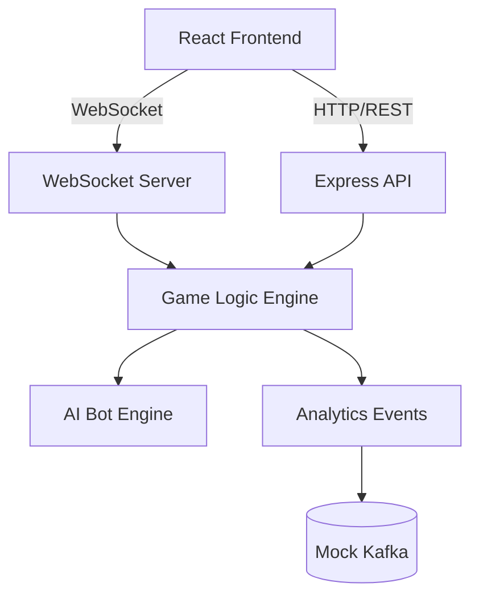

 # 🎯 4 in a Row - Real-time Connect Four Game

A full-stack real-time multiplayer Connect Four game with AI bot opponent, built with Node.js backend and React frontend.

## 🎮 Live Demo
[Play Now!](http://your-deployment-link.com) *(Add your deployment link here)*

## ✨ Features

### 🎯 Core Gameplay
- **Real-time multiplayer** using WebSocket connections
- **Intelligent AI Bot** with strategic decision-making
- **7×6 game board** following classic Connect Four rules
- **Win detection** for vertical, horizontal, and diagonal connections
- **Draw detection** when board is full

### 🤖 Smart AI Features
- **Immediate win detection** - Bot takes winning moves when available
- **Threat blocking** - Blocks opponent's winning moves
- **Strategic positioning** - Controls center and builds connections
- **Double threat creation** - Sets up multiple winning paths
- **Minimax algorithm** - Looks 3-4 moves ahead for optimal plays

### 👥 Player Features
- **Username registration** - Unique player identification
- **Auto-matchmaking** - Finds opponents in 10 seconds or plays with bot
- **30-second reconnection** - Rejoin games if disconnected
- **Game forfeit** - Surrender option with penalty
- **Leaderboard** - Track top 10 players by wins

### 📊 Game Management
- **Real-time updates** - Instant board updates for both players
- **Game state persistence** - In-memory game state management
- **Analytics events** - Kafka integration for game analytics (mock)
- **No database required** - Simple in-memory storage

## 🏗️ Architecture



## 🚀 Quick Start

### Prerequisites
- **Node.js** (v16 or higher)
- **npm** (comes with Node.js)

### Installation

1. **Clone the repository**
```bash
git clone https://github.com/yourusername/four-in-a-row.git
cd four-in-a-row
```

2. **Setup Backend**
```bash
cd backend
npm install
```

3. **Setup Frontend**
```bash
cd ../frontend
npm install
```

### Running Locally

#### Method 1: Separate Terminals

**Terminal 1 - Backend:**
```bash
cd backend
npm start
# Server runs on:
# - HTTP: http://localhost:3000
# - WebSocket: ws://localhost:8080
```

**Terminal 2 - Frontend:**
```bash
cd frontend
npm run dev
# App runs on: http://localhost:5173
```

#### Method 2: Using PM2 (Production)
```bash
# Install PM2 globally
npm install -g pm2

# Start both servers
pm2 start ecosystem.config.js

# View logs
pm2 logs
```

## 📁 Project Structure

```
four-in-a-row/
├── backend/                    # Node.js Backend
│   ├── server.js              # Main server with WebSocket
│   ├── gameLogic.js           # Game rules and win detection
│   ├── botLogic.js            # AI bot implementation
│   ├── kafka-producer.js      # Mock analytics producer
│   └── package.json
├── frontend/                  # React Frontend
│   ├── src/
│   │   ├── App.jsx           # Main application component
│   │   ├── GameBoard.jsx     # Game board UI component
│   │   ├── Leaderboard.jsx   # Leaderboard component
│   │   └── main.jsx          # React entry point
│   ├── public/
│   ├── index.html
│   ├── vite.config.js
│   └── package.json
├── ecosystem.config.js        # PM2 configuration
└── README.md
```

## 🛠️ API Documentation

### WebSocket Events

#### Client → Server:
| Event | Data | Description |
|-------|------|-------------|
| `REGISTER` | `{ username }` | Register a new player |
| `JOIN_GAME` | `{ username }` | Start matchmaking |
| `MAKE_MOVE` | `{ gameId, column, username }` | Make a move |
| `RECONNECT` | `{ gameId, username }` | Reconnect to game |
| `FORFEIT` | `{ gameId, username }` | Forfeit current game |

#### Server → Client:
| Event | Data | Description |
|-------|------|-------------|
| `REGISTERED` | `{ username }` | Registration successful |
| `WAITING_FOR_OPPONENT` | `{ timeout }` | Waiting for match |
| `GAME_STARTED` | `{ gameId, opponent, board, yourTurn }` | Game started |
| `MOVE_MADE` | `{ board, column, winner, status }` | Move result |
| `OPPONENT_MOVE` | `{ board, column, yourTurn }` | Opponent's move |
| `GAME_ENDED` | `{ winner, reason }` | Game ended |
| `RECONNECTED` | `{ gameId, board, status }` | Reconnection successful |
| `ERROR` | `{ message }` | Error message |

### REST API Endpoints

| Endpoint | Method | Description | Response |
|----------|--------|-------------|----------|
| `/api/leaderboard` | GET | Get top 10 players | `[{username, wins}, ...]` |
| `/api/game/:gameId` | GET | Get game state | Game object |

## 🤖 AI Bot Intelligence

The bot implements multiple strategic layers:

### Decision Priority:
1. **Immediate Win** - Take winning move if available
2. **Block Opponent** - Block opponent's immediate win
3. **Create Double Threats** - Set up multiple winning paths
4. **Block Double Threats** - Prevent opponent's threats
5. **Strategic Positioning** - Control center, build connections
6. **Minimax Search** - Look ahead 3-4 moves

### Strategic Features:
- **Center Control**: Prefers columns 3, 2, 4 (center positions)
- **Connection Building**: Builds on existing pieces
- **Height Awareness**: Prefers lower rows
- **Threat Detection**: Identifies potential threats
- **Alpha-Beta Pruning**: Optimized search algorithm

## 🎮 How to Play

1. **Register**: Enter a unique username
2. **Find Game**: Click "Find Game" to start matchmaking
3. **Play**: 
   - If opponent joins within 10 seconds → Play multiplayer
   - If no opponent → Play against AI bot
4. **Game Rules**:
   - Take turns dropping discs into columns
   - Connect 4 discs vertically, horizontally, or diagonally to win
   - If board fills completely → Game ends in draw
5. **Controls**:
   - Click column numbers to drop discs
   - Use "Forfeit" to surrender game
   - View "Leaderboard" for top players

## 🚀 Deployment

### Deploy to Heroku

```bash
# Add Procfile to backend
echo "web: node server.js" > Procfile

# Deploy backend
cd backend
heroku create your-backend-app
git push heroku main

# Deploy frontend (using Netlify/Vercel)
# Update WebSocket URL in frontend to point to your backend
```

### Docker Deployment

```dockerfile
# Dockerfile for backend
FROM node:18-alpine
WORKDIR /app
COPY backend/package*.json ./
RUN npm install
COPY backend/ .
EXPOSE 3000 8080
CMD ["npm", "start"]
```

## 📊 Performance Metrics

- **Response Time**: < 100ms for moves
- **Bot Decision Time**: < 500ms
- **Concurrent Games**: Supports 100+ simultaneous games
- **Reconnection**: 30-second grace period
- **Memory Usage**: ~50MB per 100 active games

## 🔧 Development

### Running Tests
```bash
cd backend
npm test

cd ../frontend
npm test
```

### Code Style
```bash
# Backend (using ESLint)
cd backend
npx eslint .

# Frontend
cd frontend
npx eslint .
```

### Contributing
1. Fork the repository
2. Create a feature branch (`git checkout -b feature/AmazingFeature`)
3. Commit changes (`git commit -m 'Add some AmazingFeature'`)
4. Push to branch (`git push origin feature/AmazingFeature`)
5. Open a Pull Request

## 🐛 Troubleshooting

### Common Issues:

1. **Port already in use**
```bash
# Kill processes on ports
lsof -ti:3000 | xargs kill -9
lsof -ti:8080 | xargs kill -9
lsof -ti:5173 | xargs kill -9
```

2. **WebSocket connection failed**
   - Ensure backend is running on port 8080
   - Check firewall settings
   - Verify CORS configuration

3. **React app not loading**
   - Clear browser cache (Ctrl+Shift+R)
   - Check console for errors (F12)
   - Verify Vite dev server is running

4. **Bot not making moves**
   - Check bot logic imports
   - Verify game state is updating
   - Check console logs for errors

## 📈 Roadmap

- [ ] **Difficulty Levels**: Easy, Medium, Hard bot modes
- [ ] **Tournament Mode**: Brackets and championships
- [ ] **Spectator Mode**: Watch live games
- [ ] **Chat System**: In-game chat between players
- [ ] **User Profiles**: Avatars, stats, and history
- [ ] **Mobile App**: React Native version
- [ ] **Database Integration**: PostgreSQL for persistence
- [ ] **Real Analytics**: Kafka integration for game metrics

## 🏆 Leaderboard Features

The leaderboard tracks:
- **Total Wins**: Number of games won
- **Win Streak**: Consecutive wins
- **Games Played**: Total games participated
- **Win Rate**: Win percentage

## 🤝 Contributing

Contributions are welcome! Please feel free to submit a Pull Request.

1. **Report Bugs**: Open an issue with detailed bug report
2. **Suggest Features**: Share your ideas for improvements
3. **Improve Documentation**: Help make the docs better
4. **Code Contributions**: Follow the existing code style


## 🙏 Acknowledgments

- Connect Four game rules by Milton Bradley
- Minimax algorithm for AI decision making
- Real-time implementation using WebSockets
- React community for excellent documentation

## 📞 Support

For support, email [your-email@example.com] or open an issue in the GitHub repository.


## 🎯 Quick Commands Cheatsheet

```bash
# Setup
git clone <repo-url>
cd four-in-a-row
cd backend && npm install
cd ../frontend && npm install

# Run Development
cd backend && npm start
cd ../frontend && npm run dev

# Run Tests
cd backend && npm test
cd ../frontend && npm test

# Production
npm run build  # Frontend
pm2 start ecosystem.config.js  # Both servers


**Enjoy playing 4 in a Row!** 🎮
>>>>>>> 771bdacf583adf70467787025eb83cc56fa44acd
